# Hough Transform
## Steps
- Smoothing the image
	> _Image Blurring_ (_Image Smoothing_). _Image blurring_ is achieved by convolving the image with a low-pass filter kernel. It is useful for removing noise.
	
 - Edge Detection
	> _Edge detection_ is a technique of image processing used to identify points in a digital image with discontinuities, simply to say, sharp changes in the image.
	
 - Region Of Interest
	> A **region of interest** (often abbreviated **ROI**) is a sample within a data set  identified for a particular purpose.
	
 - Accumulation into (ρ, θ)-space using Hough transform
	> In polar coordinates line is define by ρ and θ where ρ is the norm distance of the line from origin. θ is the angle between the norm and the horizontal x axis.
	
 - Non local maxima suppression
	> Non Maximum Suppression (NMS) is a technique used in numerous computer vision tasks. It is a class of algorithms to select one entity (e.g., bounding boxes, or in our case one line) out of many overlapping entities.

- Sort local maxima points in descending order
	> To get the most voted lines.

 - Reconstruct lines into (x, y)-space
    > To Draw the lines in the original image coordinates. 

 - Draw lines on the original image
 
## Example 1
### Original Image:
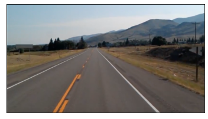

### Step1: Smoothing the image 
	In this step we used the medianBlur function from openCV library with a
	kernal size equals 7.
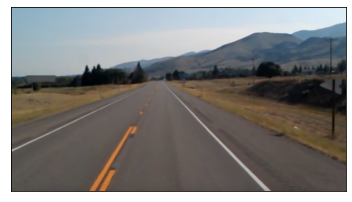

### Step2: Edge Detection
	In this step we use the Canny function from openCV library with a 100
	as threshold1 and 200 as threshold2.

### Step3: Region Of Interest
	From the output image in step2 we can notic that our rigon of interest
	is approximately bounded by these four points (350, 0), (350, 1000), 
	(1300, 1000), and (1300, 0). We used polygon2mask function from skimage 
	library to mask the edge detection output image.

### Step4: Accumulation into (ρ, θ)-space using Hough transform
	In this step we used an accumlator with size of 
	(MAX_RHO * 2, MAX_THETA + 1).

### Step5: Non local maxima suppression
	In this step we used a window with a size of 100. 
	
### Step6: Sort local maxima points in descending order
	In this step we was only interested in the maximum three lines
	(the road edges).
	
### Step7: Reconstruct lines into (x, y)-space
	We recontructed the lines from the original lines formula:
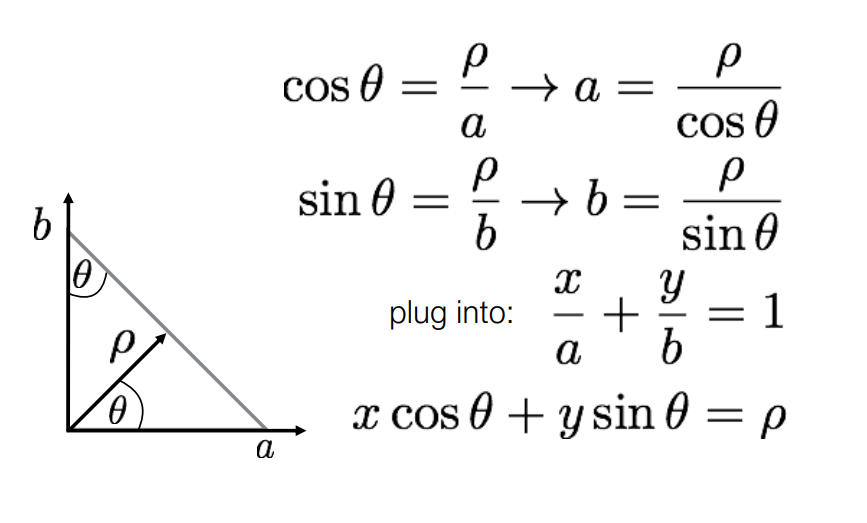
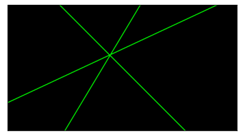
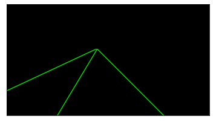

### Step8: Draw lines on the original image

## Example 2
### Original Image:
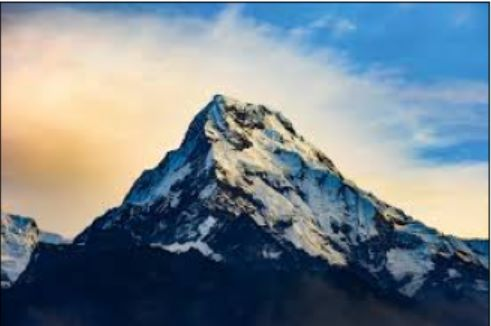

### Step1: Smoothing the image 
	In this step we used the medianBlur function from openCV library with a
	kernal size equals 11.
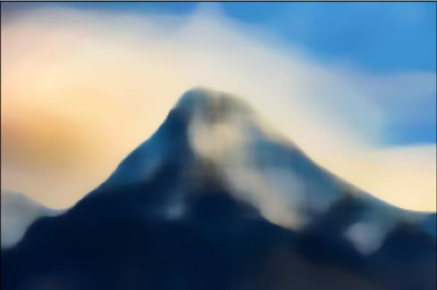

### Step2: Edge Detection
	In this step we use the Canny function from openCV library with a 100
	as threshold1 and 200 as threshold2.
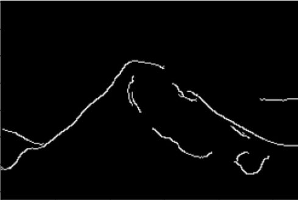

### Step3: Region Of Interest
	From the output image in step2 we can notic that our rigon of interest
	is approximately bounded by these four points (20, 150), (175, 0), (175, 275). We used polygon2mask function from skimage 
	library to mask the edge detection output image.
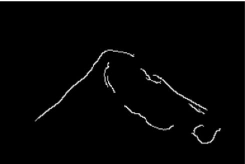

### Step4: Non local maxima suppression
	In this step we used a window with a size of 100. 
	
### Step5: Sort local maxima points in descending order
	In this step we was only interested in the maximum two lines
	(the road edges).
	
### Step6: Reconstruct lines into (x, y)-space
	We recontructed the lines from the original lines formula:
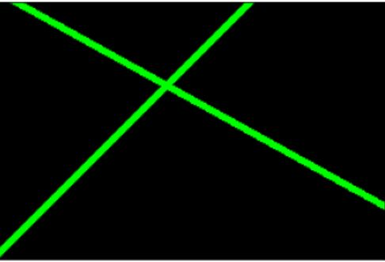
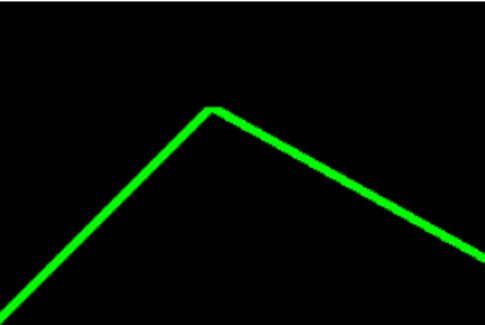

### Step8: Draw lines on the original image
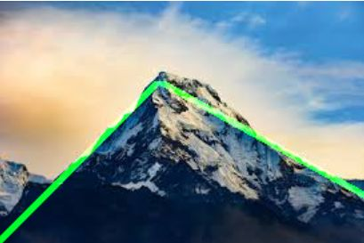
